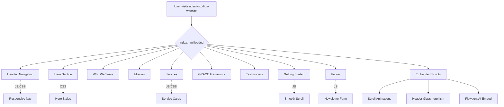
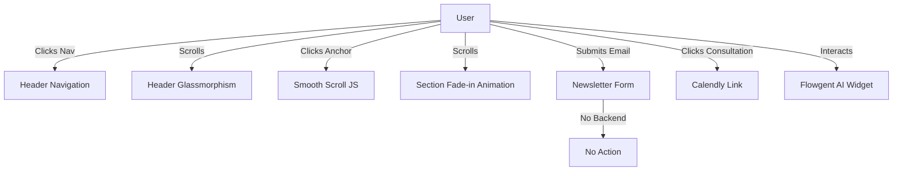
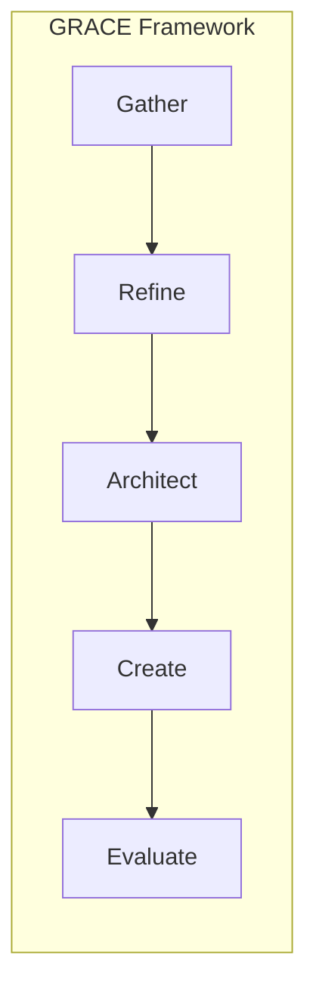

# Adsalt Studios Website: Comprehensive Documentation

## Table of Contents
- [Project Overview](#project-overview)
- [System Architecture](#system-architecture)
- [Development Perspective](#development-perspective)
- [Testing Perspective](#testing-perspective)
- [Product Management Perspective](#product-management-perspective)
- [Appendix: Mermaid Diagrams](#appendix-mermaid-diagrams)

---

## Project Overview
Adsalt Studios' website is a single-page, static HTML site designed to present the consulting firm's services, philosophy, and client results. The site is modern, responsive, and uses embedded CSS and JavaScript for interactivity and style. There is no backend or build system; all logic and styling are contained within `index.html`.

---

## System Architecture

### High-Level Structure
- **index.html**: The sole source file, containing all HTML, CSS, and JavaScript.
- **No external build tools**: No frameworks, package managers, or server-side code.
- **External dependencies**: Google Fonts, Flowgent AI widget, Calendly links.

#### Website Structure Diagram

### Key Technologies
- **HTML5**: Semantic structure for all content.
- **CSS3**: Custom properties, responsive design, glassmorphism, and animations.
- **JavaScript**: Navigation toggling, smooth scrolling, section animations, header effects.
- **External**: Google Fonts, Flowgent AI, Calendly.

---

## Development Perspective

### File Layout
- `index.html`: All code (HTML, CSS, JS) is here.
- `.git/`: Standard Git version control, no custom hooks.
- `README.md`: Minimal project description.

### Main Components
- **Header**: Fixed, glassmorphic on scroll, responsive nav.
- **Hero Section**: Tagline, subtitle, CTAs.
- **Who We Serve**: Cards for target audiences.
- **Mission**: Philosophy and a visual process diagram.
- **Services**: Three main offerings, each with features and CTAs.
- **GRACE Framework**: Five-step process for client work.
- **Testimonials**: Client quote and business stats.
- **Getting Started**: Steps to engage, trust signals, and consultation CTA.
- **Footer**: Quick links, contact info, newsletter form.

### Notable Features
- **Responsive Design**: Media queries for mobile/tablet/desktop.
- **Glassmorphism**: Header and process steps use blur and transparency.
- **Animations**: Fade-in on scroll for sections.
- **No Backend**: Newsletter form is non-functional (no submission logic).
- **External Widgets**: Calendly for booking, Flowgent AI for chat.

---

## Testing Perspective

### Manual Testing Checklist
- [ ] **Navigation**: All links scroll to correct sections or open external pages.
- [ ] **Responsive Layout**: Site displays correctly on mobile, tablet, and desktop.
- [ ] **Header Effects**: Glassmorphism activates on scroll.
- [ ] **Section Animations**: Sections fade in as they enter viewport.
- [ ] **CTAs**: All buttons and links work as intended.
- [ ] **Newsletter Form**: Input and button are present (no backend action).
- [ ] **Accessibility**: Sufficient color contrast, alt text on images, keyboard navigation.
- [ ] **Performance**: Fast load, minimal external dependencies.

### Automated Testing
- Not applicable (no backend, no build system, no test framework).

---

## Product Management Perspective

### User Journey
1. **Landing**: User sees brand, tagline, and main CTAs.
2. **Explore**: User scrolls to see who Adsalt helps, the mission, and services.
3. **Learn**: User reviews the GRACE framework and testimonials.
4. **Engage**: User books a consultation or subscribes to the newsletter.

### Value Proposition
- **For Small Businesses**: Modernization, automation, and digital transformation.
- **For Creatives/Entrepreneurs**: Launch support, prototyping, and business strategy.
- **Community Focus**: Emphasis on technology serving people and place.

### Key Flows Diagram

### GRACE Framework Process

---

## Appendix: Mermaid Diagrams
- **Website Structure**: See [System Architecture](#system-architecture)
- **User Flows**: See [Product Management Perspective](#product-management-perspective)
- **GRACE Framework**: See [Product Management Perspective](#product-management-perspective)

---

*This documentation was generated to provide a holistic view of the Adsalt Studios website for all stakeholders: architects, developers, testers, and product managers.* 